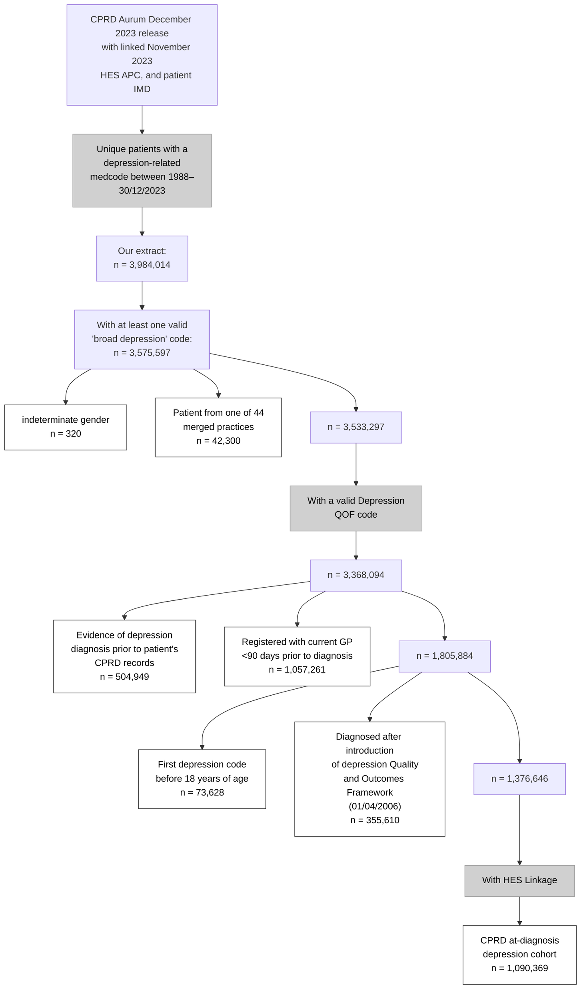

# CPRD depression cohort
**NOTE:** This GitHub is currently under development. While all code is present, there may be substantial changes to definitions at the descretion of the author.

For further information, please contact:  
Dr. Dale Handley  
Social, Genetic, and Developmental Psychiatry Centre  
King's College London  
dale.handley@kcl.ac.uk

## Cohort definition
This Github details the construction of the CPRD depression cohort using the February 2024 CPRD data extraction.
The intent of this approach is to maximise the number of individuals where their current depressive episode represents their first ever depressive episode.

The inclusion and exclusion for this cohort prior to study-specific QC have been adapted from previous work presented [HERE](https://github.com/Exeter-Diabetes/CPRD-Cohort-scripts) Several key changes, as outlined in this README section, were required given the episodic nature of depression, however the baseline QC follows a similar flow.

**Inclusion:**
  - A Quality Outcome Framework code for depression. This is a SNOMED-CT code set pushed by [NHS primary care domain reference sets](https://www.opencodelists.org/codelist/nhsd-primary-care-domain-refsets/depr_cod/20250912/) and acts as the primary source for receiving a re-imburseable depression diagnosis. This code list also includes "non-diagnostic" codes, such as "Treatment resistant depression", which are re-imburseable but definitionally require previous GP consultation to be valid. Therefore, we required that individuals have at least one broad "diagnostic" QOF depression code at any time during their clinical journey.

**Exclusion:**
  - Patient is from one of the 44 practices that may have merged. This removes individuals who might have unreliable data tracking due to administrational changes.
  - Undetermined Gender
  - Non-diagnostic depression codes present at first evidence of depression (see broad_depression code list).
  - Diagnosed with depression after introduction of depression into the Quality and Outcomes Framework (01/04/2006). Prior to 2006, there were systematic regional differences in how depression was coded in primary care. This has been minimised with the use of QOF-standardised clinical codes. 

All scripts related to the baseline QC of the cohort can be found [HERE](scripts/cohort/)

### Index date definition
While all individuals were required to have a QOF depression medcode for inclusion in this study, we allowed index dates to reflect the earliest occurrence of depression identified using the "Broad depression" code list (found [HERE] (

## Further QC considerations

## Further adjustments of index date
Antidepressant use was considered as a primary indicator of depression diagnosis. Given that non-SSRIs (especially since the 1990s) have been the primary first-line antidepressant for depression treatment, we only considered SSRIs as an indicator. We made this adjustment as we found that, even using our strict code list requirements, approximately 70% of individuals initiate an antidepressant prior to their first depression code. In turn, by only considering SSRIs as an indicator of diagnosis, we minimise the number of historical cases included in our data.

The follow criteria were used to define an antidepressant-informed index date: 

- The patient must receive an SSRI as their first antidepressant. 
- The patient must receive their first antidepressant prescription more than 90 days after their current GP practice registration. This approach prevents legacy prescriptions being treated as a new depressive episode.
- In line with our QOF guideline-based cohort design, individuals must receive their first antidepressant prescription after the introduction of depression to the QOF (01/04/2006). 

From this point, individuals had two index dates:
- A date at which they first received a diagnostic depression code
- A date at which, if ever, they first received an antidepressant.

For all individuals, their depression index date was defined as the earliest of these two dates. The code for this section is available [HERE](/scripts/cohort/create_antidepressant_index_dates.R)

### Exclusion of severe mental illness cases
Given the strongest relationship between early depressive symptoms and progression to severe mental illness, it might be appropriate (depending on your analysis) to exclude individuals with evidence of severe mental illness which pre-exists the first depression code/SSRI prescription. Therefore, the script should be adjusted to meet your specific cohort index date used. We provide the code for SMI exclusion (including hospitalisation for depression with psychotic features, schizophrenia, bipolar disorder, and other psychoses) [HERE](scripts/cohort/create_SMI_phenotypes.R). For some studies, it might be more appropriate to avoid SMI-based exclusions, as SMIs form part of the heterogeneity that composes depression in a primary care setting.

## Clinical heterogeneity in depression
All scripts and codes related to these phenotypes are included in cohort_scripts/depression_phrenotypes section of this Repo.
Where possible, all phenotypes were defined as events, besides antidepressant adherence.

### Public Health Questionnaire-9 results
The PHQ-9 is a questionnaire that is used for both depression screening and severity testing.
The questionnaire is composed of 9 questions, each of which can have a maximum value of 3 points. For diagnosis, the following categories are sometimes used:

  - **Score 10+:** Cut off score used to denote a current episode of depression.
  - **Score 10 - 14:** Moderate depression
  - **Score 15 - 19:** Moderately severe depression
  - **Score 20+:** Severe depression

A PhQ-9 score at index was defined as having been recorded within 30 days before or 7 days after either receiving their first antidepressant or depression code. The 7 day excess window is allow for delayed entry time into EMIS. 

PHQ-9 measurements are recorded in three primary forms:
- **scores**: These are raw scores, which range from 0 - 27. Measurements where the score was recorded as below 0 or above 27 were excluded. These scores account for >90% of all recorded scores in CPRD Aurum. 
- **Partial scores**: These are PHQ scores which were recorded by each item on the questionnaire. For an individual to have a valid score, they must have all 9 items from the PHQ-9 recorded on the same date, no individual item must be below 0 or above 3, and the total score of the combined items must be above 0 and below 27.
- **category**: As described above, clinical interpretation of the PHQ-9 is usually done via use of categorisation. Where categories were provided, they were replaced with the middle value for the category.

We then chose the PHQ-9 value which was closest to index date as the value for the "PHQ-9 at index" phenotype. In the event that multiple PHQ-9 codes were available on the same date, we prioritised complete scores, then partial scores, then categories. Once this QC was performed, PHQ-9 scores were also transformed backwards to create the PHQ-9 clinical categories.

### Recurrent depression
Recurrent depression was defined as evidence for starting a new depressive episode. Given variable definitions in the literature, we considered four different definitions of recurrence:
- **3 month window, code-based**: a new episode was considered as receiving no new depression codes within a 3 month window.
- **6 month window, code-based**: As above, but requires a 6 month gap.
- **3 month window, code and prescription based**: A new episode was considered as receiving no new depression codes or antidepressant prescriptions within a 3 month window.
- **6 month window, code and prescription based**: As above, but requires a 6 month gap.

### Antidepressant use
Antidepressant use was defined as having a prescription of any antidepressant, as outlined in the sections above.

### Ever prescribed a different antidepressant of the same class (SSRI)
This was defined as the first instance at which an individual  received a prescription for another SSRI (as all individuals were required to try an SSRI first as part of the inclusion criteria). 

### Ever prescribed another antidepressant class
This was defined as the first instance at which an individual received a prescription for a non-SSRI antidepressant prescription. 

### Antidepressant coverage
Over a given time frame, antidepressant use was calculated using Percentage days covered, as described by https://pubmed.ncbi.nlm.nih.gov/40696379/. As it might be expected that individuals are not required all the time, PDC more accurately describes the amount of time covered by antidepressant prescriptions as a measure of ongoing depression treatment rather than a proxy for medication adherence.

### Treatment resistant depression
For treatment resistance, we used a previously published definition. Briefly, prescriptions were split into 6 month windows, where a new episode began when there was more than 6 months since the previous antidepressant prescription. Treatment resistance was defined as receiving a third antidepressant within given time frames, in line with clinical prescribing guidelines (https://pubmed.ncbi.nlm.nih.gov/33753889/). 

### Augmentation therapy with antipsychotics
Augmentation therapy was considered as receiving one of four widely used antipsychotics for augmentation therapy:
- Quetiapine
- Rispiradone
- Aripiprazole
- Olanzapine

This list was defined based on consensus from practicing psychiatrist collaborators and a data-driven approach. In total, 85% of all listed augmentations were one of the four described antipsychotics.

We also considered two definitions:
- **Clinical definition**: Defined according to Fabbri et al 2021 (https://pubmed.ncbi.nlm.nih.gov/33753889/). Individuals were required to have a prescription overlap of at least 30 days with an antidepressant. This definition is very strict but is closest to approximating the guidelines for antipsychotic augmentation in depression.
- **Real-world definition**: In this case, we require a single prescription for one of these antidepressant to be considered as augmentation. Although the clinical guidelines definition is ideal, we recognise that many individuals may frequently change antidepressants and/or require rapid antipsychotic augmentation if they have very severe depression. 

### Hospitalisation for depression
Hospitalisation for depression was considered as receiving and ICD-10 code for depression (F32 - F33). We considered two definitions to reflect recording in secondary care hospitalisation records:

- **Primary hospitalisation**: Primary hospitalisation was considered as a listing where the primary cause of hospitalisation into admitted patient care was depression. These are the most "clean-cut" hospitalisation cases.
- **Secondary hospitalisation**: Secondary hospitalisation was considered as receiving a non-primary hospitalisation code for depression. We find this phenotype might be interesting, as there might be specific causes for listing of depression during admitted patient care.

### Secondary referrals
A secondary referral is considered any referall to any secondary care provider. While this phenotype is highly heterogenous, it was designed to encapsulate all individuals who required psychiatric care that could not be fully provided by the primary care provider. 
